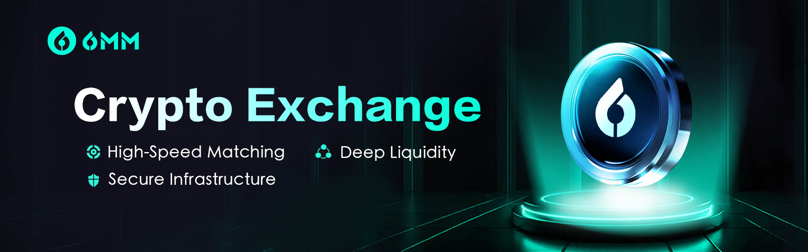

6MM provides modular digital asset trading infrastructure for platforms that want to launch, embed, or scale professional trading capabilities without rebuilding the full exchange stack.

<Frame>
  
</Frame>

<h2 id="core-solution-lines">Core solution lines</h2>

<CardGroup cols={2}>
<Card title="Embedded API / SDK Trading System" icon="fa-duotone fa-window" href="/solutions/embedded-trading">
Add perpetual trading capabilities to an existing app, wallet, broker, traffic platform, or business system through APIs and SDKs.
</Card>
<Card title="Institutional Liquidity Solutions" icon="fa-duotone fa-water" href="/solutions/institutional-liquidity">
Connect trading venues and partner platforms to deeper liquidity, automated market making, and risk-aware liquidity operations.
</Card>
<Card title="White-label Exchange System" icon="fa-duotone fa-store" href="/solutions/white-label-exchange">
Launch a branded exchange experience with matching, risk, liquidity, multi-terminal frontends, and operational tooling.
</Card>
<Card title="Compliance Licensing & Consulting" icon="fa-duotone fa-scale-balanced" href="/solutions/compliance-licensing">
Plan the compliance, licensing, and technical foundation for regulated digital asset trading businesses.
</Card>
</CardGroup>

<h2 id="which-path-should-i-choose">Which path should I choose?</h2>

| Business goal | Recommended solution | Primary docs |
| --- | --- | --- |
| Add trading to an existing product | Embedded API / SDK Trading System | SDKs, Developers |
| Improve market depth and execution quality | Institutional Liquidity Solutions | Trading, Developers |
| Launch a branded exchange quickly | White-label Exchange System | Solutions, Resources |
| Prepare for regulated operations | Compliance Licensing & Consulting | Security & Compliance |

<h2 id="how-the-solutions-connect">How the solutions connect</h2>

Most partner implementations combine more than one 6MM capability. A white-label exchange may use institutional liquidity, compliance support, and API integrations. An embedded trading partner may start with the Trading Widget SDK and later add backend Agent SDK flows, webhook processing, and operational resources.
